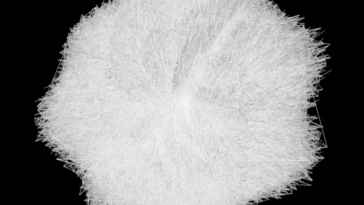

# Three.js Art Piece V1



A Three.js generative art piece: a 62.5k-node modular-arithmetic lattice woven into a 3D focal shell with crossing strands, dew nodes, orbit controls, and optional Bokeh depth of field.

Inspired by the visual language of [@hive_echo](https://x.com/hive_echo)'s [Residue Focal Web](https://x.com/hive_echo/status/2063038270297252248).

## Quick start

```bash
npm install
npm run dev
```

Open the URL Vite prints (default `http://localhost:5173`).

### Production

```bash
npm run build
npm run preview
```

Drag to orbit, scroll to zoom. Tune modulus, strands, phase, veil, dew, and Bokeh DOF from the lil-gui panel.

## Features

- ~62.5k lattice nodes, ~92k strand segments, dew highlight points
- Modular-arithmetic residue geometry with live rebuild
- Optional **BokehPass** depth of field (focus plane + aperture)
- Orbit controls with gentle auto-rotation in `?demo=1` capture mode
- Status readout with node / segment counts

## Controls

| Parameter | Effect |
|-----------|--------|
| Modulus / Residue Window | Changes the underlying arithmetic weave |
| Tension / Thread Density | Shell shape and strand packing |
| Strands / Phase | Structure density and orientation |
| Veil Weight / Dew Current | Secondary veil lines and dew brightness |
| Bokeh DOF / Focus / Aperture | Depth-of-field post effect |

Append `?demo=1` to the URL for a clean cinematic view (GUI hidden, Bokeh on, animated focus).

### Re-record README GIF

```bash
npm run dev          # terminal 1
npm run record:readme # terminal 2 — writes assets/demo.gif
```

## Stack

- Three.js (WebGL, LineSegments, Points, BokehPass)
- lil-gui
- Vite

## Credits

Original visual language and inspiration: [@hive_echo](https://x.com/hive_echo)

Reverse-engineered and rebuilt as **Three.js Art Piece V1** by [@V3gaS](https://github.com/V3gaS).

MIT license.
